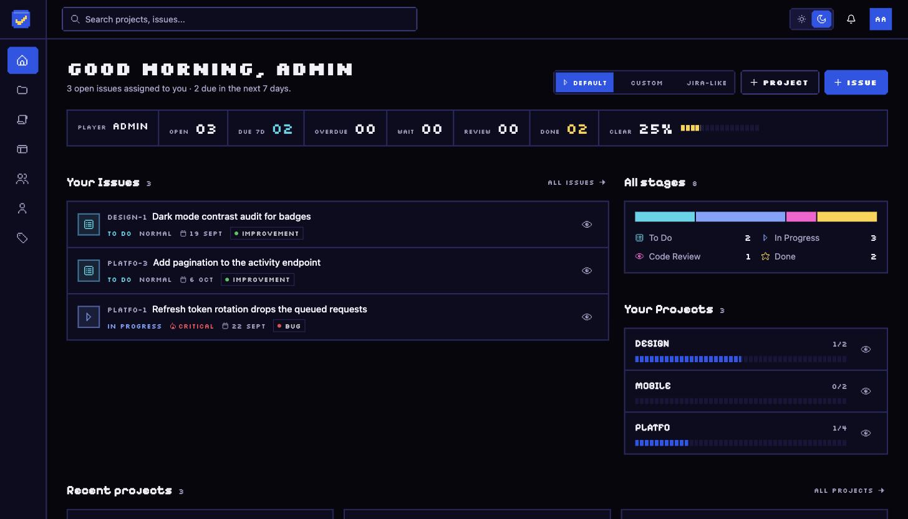
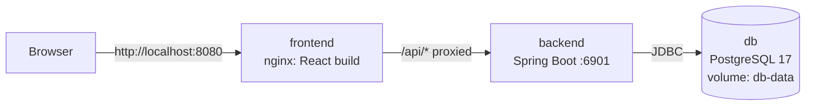

# TaskSystem

A self-hosted issue tracker for small development teams. Projects get short keys, issues move through eight workflow states from **New** to **Done**, and the board shows the difference between work that is in progress, waiting on another team, or sitting in code review.

This repository contains the whole stack:

| Part | Tech | Folder |
|---|---|---|
| Web app | React 19, Vite 7, Tailwind CSS 4, Zustand | [`frontend/`](frontend/) |
| REST API | Java 25, Spring Boot 4.1, Spring Security (JWT), JPA | [`backend/`](backend/) |
| Database | PostgreSQL 17 (Docker), H2 for quick local runs | via [`docker-compose.yml`](docker-compose.yml) |



---

## Contents

- [Features](#features)
- [Quick start with Docker](#quick-start-with-docker)
- [Demo accounts](#demo-accounts)
- [Configuration](#configuration)
- [How it fits together](#how-it-fits-together)
- [Everyday Docker commands](#everyday-docker-commands)
- [Local development without Docker](#local-development-without-docker)
- [Tests](#tests)
- [Repository structure](#repository-structure)
- [Troubleshooting](#troubleshooting)
- [Security notes](#security-notes)
- [Known limitations](#known-limitations)

---

## Features

- **Projects** with short keys (`WEB`, `API`, …); issues are numbered per project (`WEB-12`) and keep that key for life.
- **Issues** with 8 statuses (New, Triage, To Do, In Progress, Waiting for Team, Code Review, Done, Canceled), 4 priorities (Low → Critical), assignee, team, due date and labels.
- **Kanban board** with drag and drop, a *Basic* mode (3 grouped columns) and a *Detailed* mode (all 8 columns), plus a swipeable carousel on phones.
- **Collaboration**: comments with `@mentions` and pasted images, attachments, and a per-issue activity log of every change.
- **Dashboard** focused on your own work: open, due-this-week and overdue issues, workflow stage totals, your projects, charts, and three layouts (Default, Custom widgets, Jira-like side panel).
- **Teams**, global search, notifications (e.g. when an issue is assigned to you), light and dark themes.
- **Roles**: regular users and admins (user management, label management).
- **PWA**: installable on desktop and mobile.
- **Demo mode**: one-click sign-in from the login page plus a guided tour of the interface — see [demo accounts](#demo-accounts).

---

## Quick start with Docker

### 1. Requirements

- **Docker Desktop** (macOS / Windows) or **Docker Engine + Compose plugin** (Linux).
  Check it works:

  ```bash
  docker --version
  docker compose version
  ```

  On macOS/Windows, **Docker Desktop must be running** (whale icon in the menu bar) before you use these commands.
- About **4 GB of free RAM** for the first build (Maven + npm run inside Docker).
- **Nothing else**: Java, Node.js and PostgreSQL are *not* needed on your machine for this path. A PostgreSQL you installed locally does not interfere; the database inside Docker is private to the stack and does not use port 5432 on your computer.

### 2. Start the stack

```bash
git clone <this-repository-url> TaskSystem
cd TaskSystem

# Optional: copy the config and adjust ports/passwords (defaults work out of the box)
cp .env.example .env

docker compose up --build
```

The first build downloads base images and dependencies, so it takes a few minutes. Later starts take seconds.

When the backend log shows `Seeded demo workspace`, open:

**http://localhost:8080**

### 3. Log in

Use one of the [demo accounts](#demo-accounts), e.g. `demo@tasksystem.local` / `Demo123!`.

### 4. Stop

Press `Ctrl+C` in the terminal, or from another terminal:

```bash
docker compose down        # stops containers, keeps the database
docker compose down -v     # stops containers AND deletes the database (fresh demo data next start)
```

---

## Demo accounts

Created automatically on the **first start with an empty database** (see [`DemoDataSeeder`](backend/src/main/java/com/tasksystem/api/common/config/DemoDataSeeder.java)).

| Email | Password | Role | Notes |
|---|---|---|---|
| `demo@tasksystem.local` | `Demo123!` | User | Best account to explore: several assigned issues, one overdue, some due this week |
| `admin@tasksystem.local` | `Admin123!` | Admin | Access to user and label management |
| `ola@tasksystem.local` | `Demo123!` | User | Owns the *Mobile Client* project |
| `kuba@tasksystem.local` | `Demo123!` | User | Member of the Frontend team |
| `marta@tasksystem.local` | `Demo123!` | User | Owns the *Platform API* project |

The seed also creates:

- 3 teams: Frontend, Backend, Product Design
- 3 projects: `WEB` Web App, `API` Platform API, `MOBILE` Mobile Client
- 13 issues spread over all 8 statuses and 4 priorities, with labels, due dates relative to today, comments and activity history

The seed runs only when the database has no projects, so it never overwrites your data. To get a fresh demo workspace, run `docker compose down -v` and start again. To start with an empty workspace (admin account and labels only), set `DEMO_SEED=false` **before** the first start.

> These passwords are public. Do not expose a demo instance to the internet without changing them or disabling the seed.

### One-click demo login

The login page shows a **Try the demo** button whenever the demo account exists, so nobody has to copy a password out of this README.

| Endpoint | Purpose |
|---|---|
| `GET /api/v1/auth/demo` | `{ "available": true, "email": "demo@tasksystem.local" }` — the frontend uses it to decide whether to show the button |
| `POST /api/v1/auth/demo` | Signs in as the demo account and returns the usual token pair |

Both are public (no token required) and both refuse with `403` when `DEMO_SEED=false`, when the account was deleted, or when it has been disabled — so a production instance with the seed turned off never exposes them.

### Guided tour

The first time someone signs in through **Try the demo**, a 12-step walkthrough starts on the dashboard and points at the real elements: the HUD counters, your issue queue, the stage breakdown, project cards, the three dashboard layouts, the New issue button, the navigation, search and the theme switch. Arrow keys move between steps, `Esc` leaves.

It runs once per browser (`localStorage` key `tour_seen:<userId>`) and only for demo sessions. The **Guide** button in the dashboard header replays it at any time, for any account. Source: [`frontend/src/features/tour`](frontend/src/features/tour).

---

## Configuration

All settings live in a `.env` file next to `docker-compose.yml`. Copy [`.env.example`](.env.example) to `.env`; every variable has a default, so the file is optional.

| Variable | Default | What it does |
|---|---|---|
| `APP_PORT` | `8080` | Port on your machine where the app is served (`http://localhost:APP_PORT`) |
| `POSTGRES_DB` | `tasksystem` | Database name |
| `POSTGRES_USER` | `tasksystem` | Database user |
| `POSTGRES_PASSWORD` | `tasksystem` | Database password |
| `JWT_SECRET` | local placeholder | Key that signs login tokens. **Change it** outside local testing (min. 32 bytes, e.g. `openssl rand -base64 48`) |
| `DEMO_SEED` | `true` | Create demo accounts and sample data on the first start |

> Database credentials are applied when the database volume is **created**. If you change `POSTGRES_*` after the first start, run `docker compose down -v` (this deletes the data) so PostgreSQL is initialised with the new values.

After changing `.env`, restart with `docker compose up -d --build`.

---

## How it fits together



- **One address for everything.** nginx in the `frontend` container serves the built React app and forwards every `/api/...` request to the `backend` container. The browser only ever talks to `http://localhost:8080`, so there are no CORS issues and no API URL baked into the frontend.
- **`backend`** runs with the Spring profile `docker` ([`application-docker.yml`](backend/src/main/resources/application-docker.yml)), which switches from H2 to PostgreSQL and reads credentials from the environment. Hibernate creates and updates the schema (`ddl-auto: update`).
- **`db`** keeps its data in the named volume `db-data`, so it survives restarts and rebuilds. It is not published to your machine.
- **Startup order**: `db` has a health check; `backend` waits until PostgreSQL accepts connections, then seeds data; `frontend` starts after `backend`.
- **Builds are multi-stage**: Maven and npm only exist in the build stage; the final images contain a JRE + jar and nginx + static files.

---

## Everyday Docker commands

```bash
docker compose up --build           # build (if needed) and start, logs in the terminal
docker compose up -d --build        # same, in the background
docker compose ps                   # status of the three containers
docker compose logs -f backend      # follow API logs (also: frontend, db)
docker compose restart backend      # restart one service
docker compose down                 # stop, keep data
docker compose down -v              # stop and delete the database volume

# Open a psql shell inside the database container
docker compose exec db psql -U tasksystem -d tasksystem
```

After you change code in `frontend/` or `backend/`, run `docker compose up --build` again to rebuild the changed image.

To reach the database or the API directly from your machine (e.g. pgAdmin, Postman), uncomment the `ports` sections for `db` (`localhost:5433`) or `backend` (`localhost:6901`) in `docker-compose.yml`.

---

## Local development without Docker

Faster feedback while coding: run the API with an embedded H2 database and the frontend with Vite's dev server.

**Requirements:** JDK 25+, Node.js 20.19+ (or 22+), npm.

### Backend (http://localhost:6901)

```bash
cd backend
./mvnw spring-boot:run
```

- Uses a file-based H2 database in `backend/data/` (ignored by git). Delete that folder to reset.
- Seeds the admin account and labels. For the full demo workspace:

  ```bash
  APP_DEMO_SEED=true ./mvnw spring-boot:run
  ```

- H2 console: http://localhost:6901/h2-console (JDBC URL `jdbc:h2:file:./data/tasksystem`, user `sa`, empty password).
- To develop against PostgreSQL instead, run with `SPRING_PROFILES_ACTIVE=docker` and set `SPRING_DATASOURCE_URL`, `SPRING_DATASOURCE_USERNAME`, `SPRING_DATASOURCE_PASSWORD`.

More details: [`backend/README.md`](backend/README.md).

### Frontend (http://localhost:3000)

```bash
cd frontend
npm install
cp .env.example .env      # sets VITE_API_BASE_URL=http://localhost:6901
npm run dev
```

The API allows browser requests from `localhost:3000`, `5173` and `4173` by default.

More details: [`frontend/README.md`](frontend/README.md).

---

## Tests

```bash
# Backend (JUnit, Spring Boot test slices)
cd backend && ./mvnw test

# Frontend (Vitest + Testing Library)
cd frontend && npm install && npm run test:run
```

---

## Repository structure

```
TaskSystem/
├── docker-compose.yml      # db + backend + frontend
├── .env.example            # all configurable values
├── backend/
│   ├── Dockerfile          # Maven build → JRE runtime
│   ├── pom.xml
│   └── src/main/
│       ├── java/com/tasksystem/api/
│       │   ├── auth/  user/  project/  issue/  team/  comment/
│       │   ├── file/  masterdata/  notification/  system/
│       │   └── common/config/DemoDataSeeder.java
│       └── resources/
│           ├── application.yml          # local defaults (H2)
│           └── application-docker.yml   # PostgreSQL profile used by Docker
└── frontend/
    ├── Dockerfile          # npm build → nginx runtime
    ├── nginx/default.conf.template     # static files + /api proxy
    ├── PRODUCT.md  DESIGN.md           # product context and design system
    └── src/
        ├── features/       # landing, dashboard, board, issues, projects, teams, …
        ├── components/     # UI kit, layout, modals, arcade design primitives
        ├── services/       # API client (apiBase.js decides the API URL)
        └── store/          # Zustand stores
```

---

## Troubleshooting

**`docker: command not found`**
Docker is not installed or not on your PATH. Install Docker Desktop and start it once; it adds the `docker` command.

**`Cannot connect to the Docker daemon`**
Docker Desktop is installed but not running. Start it and wait until it reports that the engine is running.

**`Bind for 0.0.0.0:8080 failed: port is already allocated`**
Something else uses port 8080. Set another port in `.env`, e.g. `APP_PORT=8081`, and open `http://localhost:8081`.

**The page loads but login fails / shows a network error**
The backend is probably still starting. Check `docker compose logs -f backend` and wait for `Started TaskSystemApiApplication`. If it keeps failing with database errors, confirm `docker compose ps` shows `db` as `healthy`.

**Backend logs `password authentication failed for user "tasksystem"`**
You changed `POSTGRES_*` after the database volume was created. Run `docker compose down -v` and start again.

**No demo data appears**
The seed only runs on an empty database with `DEMO_SEED=true`. Run `docker compose down -v`, check `.env`, then `docker compose up --build`.

**I have PostgreSQL installed locally, is that a problem?**
No. The Docker database is not published on port 5432, so a local PostgreSQL keeps working independently. You don't need the PostgreSQL *Stack Builder* for this project.

**The first build is very slow or runs out of memory**
Give Docker Desktop more memory (Settings → Resources, 4 GB or more). Rebuilds reuse the cached Maven and npm dependencies.

---

## Security notes

- Change `JWT_SECRET` for anything beyond local testing.
- Demo account passwords are published in this README. Set `DEMO_SEED=false` (on a fresh database) or change/disable those accounts before exposing an instance.
- The Spring profile `prod` disables all seeding.
- Access tokens (JWT, HS256) live 15 minutes; refresh tokens are single-use, rotated on every refresh and stored in the database.

---

## Known limitations

- **No real-time push.** Notifications are fetched over REST; the SignalR hub used by an earlier .NET backend is not implemented, and the frontend falls back gracefully.
- **Schema via Hibernate.** Tables are created and updated by `ddl-auto: update`. Migrations (Flyway or Liquibase) would be the next step before production use.
- **Attachments are stored in the database** (`bytea`), limited to 10 MB per file.
